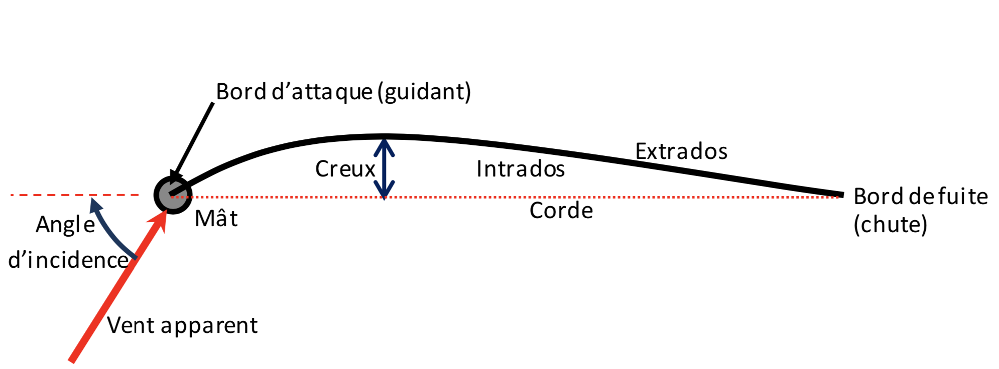

# Mécanique du dériveur

L’objectif de ce chapitre est de comprendre les mécanismes principaux qui permettent à un dériveur de naviguer à la voile. 

La mécanique du voilier est en réalité une science complexe demandant des connaissances mathématiques importantes. Des « raccourcis » importants seront faits afin d’aller à l’essentiel.

Dans tout ce qui suit, on considère un dériveur qui avance à vitesse uniforme sans modification de gîte / tangage / roulis.

## Définitions

Une voile est «découpée» en plusieurs zones qui ont des noms bien précis. 
Une voile est une surface en 3 dimensions. 

On appelle profil, une coupe de la voile le long du mât.

Le profil de la voile évolue en fonction de la hauteur mais aussi en fonction des réglages. 


